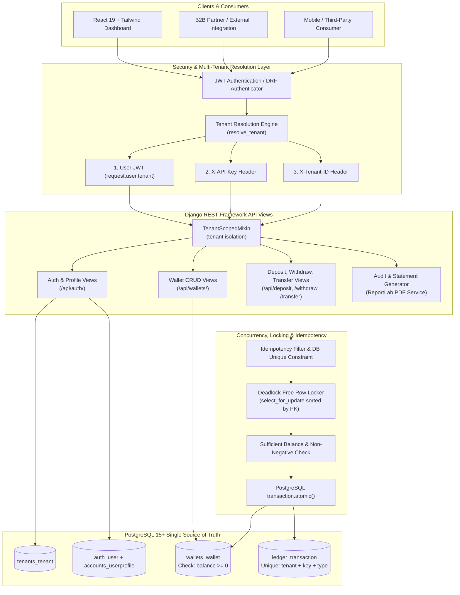
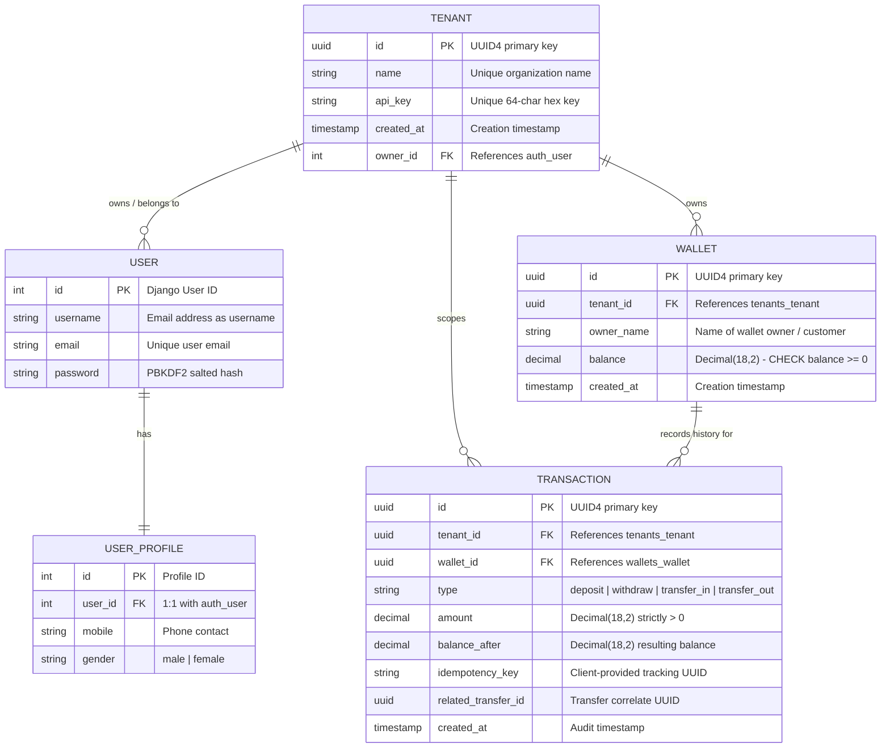
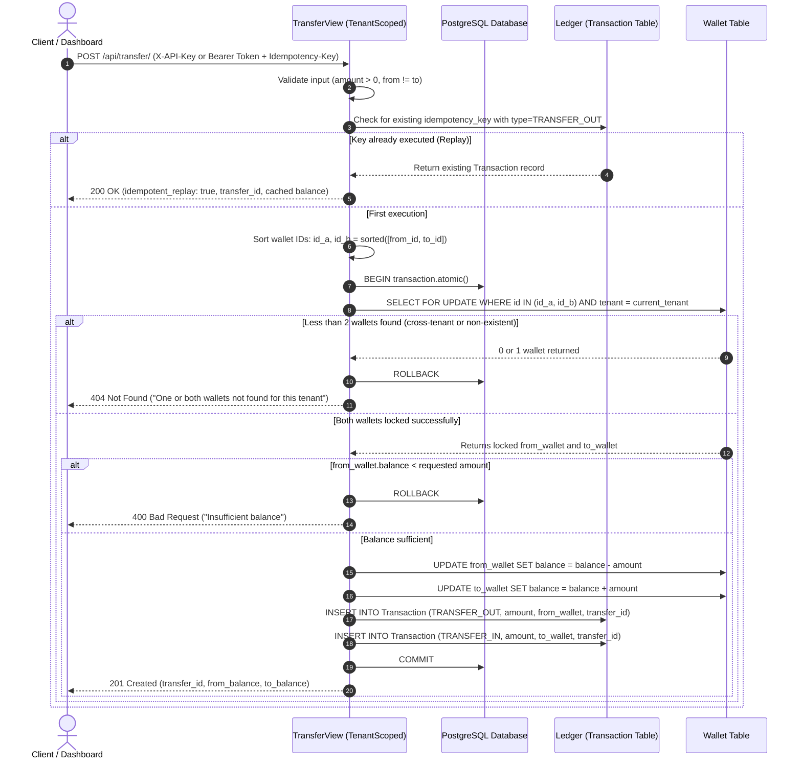

<h1 align = "center">
 Multi-Tenant Wallet & Immutable Ledger Platform
</h1>

<h1 align = "center">
 
[](https://www.djangoproject.com/)
[](https://www.django-rest-framework.org/)
[](https://www.postgresql.org/)
[](https://react.dev/)
[](https://tailwindcss.com/)

</h1>
 
An enterprise-grade, multi-tenant wallet and double-entry ledger platform designed for high-concurrency financial operations. Built in accordance with the Cashless AI Backend Engineering Assessment specifications, this platform guarantees strict multi-tenant isolation, atomic asset transfers, deadlock-free row locking, and idempotent API transactions with an immutable audit ledger.

---

## Table of Contents

- [Key Architecture & Core Principles](#-key-architecture--core-principles)
- [System Architecture (Mermaid)](#-system-architecture)
- [Entity-Relationship Diagram (Mermaid ERD)](#-entity-relationship-diagram-erd)
- [Transaction Lifecycle & Concurrency Flow](#-transaction-lifecycle--concurrency-flow)
- [Screenshots Showcase & Visual Proofs](#-screenshots-showcase--visual-proofs)
- [Feature Highlights & Edge Case Handling](#-feature-highlights--edge-case-handling)
- [API Reference & Payload Specifications](#-api-reference--payload-specifications)
- [Multi-Tenancy & Security Model](#-multi-tenancy--security-model)
- [Setup & Installation Guide](#-setup--installation-guide)
- [Design Decisions, Assumptions & Trade-offs](#-design-decisions-assumptions--trade-offs)

---

## 🛠 Technologies Used

| Domain                | Technology / Library                                                 | Version  | Purpose & Architectural Justification                                                          |
| :-------------------- | :------------------------------------------------------------------- | :------- | :--------------------------------------------------------------------------------------------- |
| **Backend Core**      | [Python](https://www.python.org/)                                    | `3.11+`  | Primary programming language with strong typing and robust standard library.                   |
| **Web Framework**     | [Django](https://www.djangoproject.com/)                             | `6.1.1`  | Robust web framework providing ORM, migrations, and security baseline.                         |
| **API Framework**     | [Django REST Framework](https://www.django-rest-framework.org/)      | `3.18.1` | Structured serialization, request validation, exception handling, and generic API views.       |
| **Authentication**    | [SimpleJWT](https://django-rest-framework-simplejwt.readthedocs.io/) | `5.5.1`  | Stateless JWT token issuance (`access`/`refresh`), token rotation, and blacklisting on logout. |
| **Database**          | [PostgreSQL](https://www.postgresql.org/)                            | `15+`    | ACID-compliant relational DB with `select_for_update()` row locking and custom constraints.    |
| **Report Generation** | [ReportLab](https://www.reportlab.com/)                              | `5.0.1`  | High-fidelity server-side dynamic PDF generation for periodic wallet audit statements.         |
| **Frontend UI**       | [React](https://react.dev/)                                          | `19.2.8` | Component-driven UI architecture for tenant dashboard and wallet operations.                   |
| **Build Tool**        | [Vite](https://vite.dev/)                                            | `8.3.0`  | High-performance frontend bundler with instant HMR and optimized production builds.            |
| **Styling**           | [Tailwind CSS](https://tailwindcss.com/)                             | `4.3.3`  | Modern utility-first CSS framework with custom responsive UI components.                       |
| **Routing**           | [React Router](https://reactrouter.com/)                             | `7.18.4` | Client-side routing with route protection and authentication guards.                           |
| **HTTP Client**       | [Axios](https://axios-http.com/)                                     | `1.20.0` | Promise-based HTTP client configured with automated JWT injection and refresh interceptors.    |

---

## Key Architecture & Core Principles

1. **Strict Multi-Tenant Isolation**:
   - Every request is resolved to an isolated tenant via JWT authentication (`request.user.tenant`) or service-level headers (`X-API-Key` or `X-Tenant-ID`).
   - Database queries are scoped strictly by tenant. Cross-tenant lookups fail with generic `404 Not Found` responses to prevent tenant ID enumeration or resource discovery.
2. **Immutable Double-Entry Ledger**:
   - The ledger (`Transaction` model) is the single source of truth.
3. **Deadlock-Free Row-Level Locking**:
   - Financial mutations execute inside PostgreSQL `transaction.atomic()` blocks using `select_for_update()`.
   - In two-party transfers, wallets are sorted deterministically by Primary Key (`sorted([from_id, to_id])`) prior to lock acquisition, preventing circular lock dependencies (deadlocks).
4. **Idempotency with Concurrency Safeguards**:
   - Mutating endpoints (`deposit`, `withdraw`, `transfer`) mandate a client-supplied `idempotency_key`.
   - Concurrent race attempts catch `IntegrityError` and safely replay the winning transaction state without duplicate debit/credit.
5. **Exact Money Handling**:
   - Handled exclusively via `DecimalField(max_digits=18, decimal_places=2)`. Floating point primitives are banned to prevent IEEE-754 precision rounding errors.
   - Non-negative balances are guaranteed by both runtime validation and database-level.

---

## System Architecture



---

## 🗄 Entity-Relationship Diagram (ERD)



---

## 🔄 Transaction Lifecycle & Concurrency Flow

The sequence diagram below demonstrates an atomic transfer between two wallets within the same tenant, highlighting idempotency validation, ordered row-locking, and audit entry persistence:



---

## 📸 Screenshots Showcase & Visual Proofs

> Place your captured application screenshots inside the `screenshots/` directory matching the filenames below.

### 1. Dashboard Overview & Tenant Context


_Real-time tenant balance rollup, active wallet counters, recent ledger transactions, and quick action controls._

---

### 2. Multi-Tenant Onboarding


_Onboarding flow with automatic tenant entity provisioning, JWT token emission, and dedicated API key generation._

---

---

### 3. Idempotent Deposit & Withdrawal Operations


_Executing deposit and withdrawal flows with idempotency key headers, verifying instant ledger reconciliation and double-spend prevention._

---

### 4. Atomic Peer-to-Peer Wallet Transfer


_Atomic fund transfer between two wallets of the same organization, showing balanced debit and credit entries with shared transfer correlation IDs._

---

### 5. Cross-Tenant Protection & Access Denied Proof


---

### 6. Immutable Ledger & Paginated Transaction Log


_Detailed transaction audit trail with pagination, type badges, idempotency keys, timestamps, and balance-after verification._

---

### 7. Downloadable PDF Audit Statement


_Exported formal PDF account statement dynamically rendered with ReportLab, featuring transaction breakdown and period filters._

### 8. Profile with dark mode


---

## ⚡ Feature Highlights & Edge Case Handling

| Challenge / Requirement       | Threat / Risk                                          | Platform Solution & Implementation                                                                                                           |
| :---------------------------- | :----------------------------------------------------- | :------------------------------------------------------------------------------------------------------------------------------------------- |
| **Race Conditions**           | Concurrent withdrawals creating negative balances.     | `select_for_update()` acquires exclusive pessimistic row locks. Combined with DB `CheckConstraint(balance__gte=0)`.                          |
| **Deadlocks**                 | Wallet A $\to$ Wallet B while Wallet B $\to$ Wallet A. | Lock keys are deterministically sorted (`sorted([id_a, id_b])`) before query execution, ensuring identical lock hierarchy.                   |
| **Network Retry Duplication** | Retried POST requests causing double debit/credit.     | Unique composite DB constraint `(tenant, idempotency_key, type)` with automatic replay logic and `IntegrityError` safety catches.            |
| **Cross-Tenant Breach**       | Malicious actor guessing UUIDs of another tenant.      | Every query enforces `filter(tenant=self.tenant)`. Cross-tenant queries return uniform `404 Not Found` without revealing resource existence. |
| **Ledger Drift**              | Balance column drifting away from transactions.        | Built-in `wallet.recompute_balance()` utility verifies that `balance == sum(credits) - sum(debits)`.                                         |
| **Floating Point Drift**      | Inexact fractional cent representation.                | All amounts stored in PostgreSQL `NUMERIC(18, 2)` mapped through Python `Decimal`.                                                           |

---

## 📡 API Reference & Payload Specifications

### Authentication & Tenant Scoping Headers

Authenticated requests require either a JWT Bearer token or direct Tenant Headers:

```http
Authorization: Bearer <jwt_access_token>
```

_or for direct service-to-service calls:_

```http
X-API-Key: <tenant_api_key>
# or
X-Tenant-ID: <tenant_uuid>
```

---

### Endpoints Matrix

#### 1. Authentication & Onboarding

- `POST /api/auth/register/` — Register user, user profile, and tenant organization.
- `POST /api/auth/login/` — Authenticate via email & password, obtain JWT pair.
- `POST /api/auth/login/refresh/` — Refresh access token.
- `POST /api/auth/logout/` — Blacklist current refresh token.
- `GET /api/auth/me/` — Retrieve user profile and associated organization info.
- `GET /api/tenants/me/` — Retrieve tenant metadata, API key, and creation date.

#### 2. Wallet Operations

- `GET /api/wallets/` — List all wallets belonging to the authenticated tenant.
- `POST /api/wallets/create/` — Create a new customer wallet for the tenant.
- `GET /api/wallets/<uuid:wallet_id>/` — Inspect specific wallet details and balance.
- `GET /api/wallets/<uuid:wallet_id>/balance/` — Quick balance query.

#### 3. Ledger & Money Movements

- `POST /api/deposit/` — Deposit funds into a wallet.
- `POST /api/withdraw/` — Withdraw funds (safely rejected if insufficient balance).
- `POST /api/transfer/` — Atomic transfer between two wallets belonging to the same tenant.
- `GET /api/wallets/<uuid:wallet_id>/transactions/` — Paginated immutable ledger transactions.
- `GET /api/wallets/<uuid:wallet_id>/statement/?days=30` — Download dynamic PDF account statement.

---

### Sample Requests & Responses

#### Transfer Funds (`POST /api/transfer/`)

```bash
curl -X POST http://localhost:8000/api/transfer/ \
  -H "Authorization: Bearer <JWT_TOKEN>" \
  -H "Content-Type: application/json" \
  -d '{
    "from_wallet_id": "b3e0c031-7b0f-48d6-a4da-2782e4e7e60b",
    "to_wallet_id": "c71120f2-777e-407a-9be2-d610fa65ea4e",
    "amount": "75.50",
    "idempotency_key": "xfer-20260327-889"
  }'
```

**Response (`201 Created`):**

```json
{
  "transfer_id": "e44d5786-9a2f-4809-9bca-4b0e7da3e2bc",
  "from_wallet_id": "b3e0c031-7b0f-48d6-a4da-2782e4e7e60b",
  "from_balance": "174.50",
  "to_wallet_id": "c71120f2-777e-407a-9be2-d610fa65ea4e",
  "to_balance": "75.50"
}
```

#### Idempotent Replay Response (`200 OK`)

When re-submitting the same payload with an identical `idempotency_key`:

```json
{
  "transfer_id": "e44d5786-9a2f-4809-9bca-4b0e7da3e2bc",
  "from_wallet_id": "b3e0c031-7b0f-48d6-a4da-2782e4e7e60b",
  "from_balance": "174.50",
  "idempotent_replay": true
}
```

---

## 🔐 Multi-Tenancy & Security Model

```
               Incoming HTTP Request
                         │
        ┌────────────────┴────────────────┐
        ▼                                 ▼
 Has Bearer JWT?                   Has Service Headers?
        │                                 │
        ▼                                 ▼
Extract request.user           Extract X-API-Key / X-Tenant-ID
        │                                 │
        ▼                                 ▼
Lookup Tenant via OneToOne        Lookup Tenant via Tenant Model
        │                                 │
        └────────────────┬────────────────┘
                         ▼
             Attach self.tenant to View
                         │
                         ▼
        Execute Query: WHERE tenant_id = self.tenant.id
```

- **Query-Level Scoping**: No view directly invokes `Wallet.objects.all()` or `Transaction.objects.all()`. Every query starts from `TenantScopedMixin` with `Wallet.objects.filter(tenant=self.tenant)`.
- **Defense in Depth**: Even if an attacker learns or generates a valid UUID of another tenant's wallet, filtering by `tenant=self.tenant` guarantees a `404 Not Found`, keeping data boundaries impenetrable.

---

## 🛠 Setup & Installation Guide

### Prerequisites

- Python 3.11+
- Node.js 18+ & npm
- PostgreSQL 14+ (or SQLite for quick test runs)

### Docker Setup (Windows / PowerShell)

Make sure Docker Desktop is running. Open PowerShell in the project root (`wallet-platform`) and create a `.env` file with the database settings used by Docker Compose:

```powershell
@'
DB_NAME=wallet_db
DB_USER=wallet_user
DB_PASSWORD=change_this_local_password
DB_HOST=db
DB_PORT=5432
'@ | Set-Content .env
```

Replace `change_this_local_password` with a local password of your choice. If you already have a root `.env` file, keep it and make sure it contains these values instead of overwriting it.

Build and start the database, API, and frontend:

```powershell
docker compose up --build
```

The first startup builds the images, waits for PostgreSQL, and runs Django migrations automatically. Open the app at `http://localhost:5173/`; the API is at `http://localhost:8000/`.

In another PowerShell window, create a Django admin user if needed:

```powershell
docker compose exec backend python manage.py createsuperuser
```

Useful commands:

```powershell
# Follow service logs
docker compose logs -f

# Stop the services and keep database data
docker compose down

# Start the services again
docker compose up
```

PostgreSQL data is stored in a Docker volume and is preserved by `docker compose down`. Avoid `docker compose down -v` unless you intend to delete the database data.

---

### 1. Backend Setup

```bash
# 1. Navigate to backend directory
cd backend

# 2. Create and activate a virtual environment
python -m venv .venv
# On Windows (PowerShell/Bash):
source .venv/Scripts/activate

# 3. Install dependencies
pip install -r requirements.txt

# 4. Configure environment variables (.env)
# Create a .env file inside backend/ with your database credentials:
cat << 'EOF' > .env
SECRET_KEY=your-super-secret-django-key
DEBUG=True
DB_NAME=wallet_platform
DB_USER=postgres
DB_PASSWORD=postgres
DB_HOST=localhost
DB_PORT=5432
EOF

# 5. Run database migrations
python manage.py makemigrations
python manage.py migrate

# 6. Create superuser
python manage.py createsuperuser

# 7. Start the backend development server
python manage.py runserver
```

The Django REST API will be available at `http://127.0.0.1:8000/`.

---

### 2. Frontend Setup

```bash
# 1. Open a new terminal and navigate to frontend directory
cd frontend

# 2. Install dependencies
npm i

# 3. Run the development server
npm run dev
```

The React Dashboard will be accessible at `http://localhost:5173/`.

---

## ⚖️ Design Decisions, Assumptions & Trade-offs

1. **Cached Balance vs. Pure Recomputation**:
   - _Decision_: Maintain an indexed `balance` column on `Wallet` while treating the immutable `Transaction` ledger as ground truth.
   - _Rationale_: Recomputing balance on every read by summing millions of ledger entries would cause unacceptable $O(N)$ database query latency. Keeping a cached balance updated within the same atomic transaction provides $O(1)$ read performance while DB constraints guarantee integrity.
2. **Deterministic Lock Ordering**:
   - _Decision_: Sort wallet IDs alphabetically/numerically before locking.
3. **Idempotency Strategy**:
   - _Decision_: Store idempotency keys directly in the `Transaction` ledger table rather than an in-memory Redis cache.
   - _Rationale_: Financial auditability requires durable idempotency history. If an application server crashes, database persistence ensures idempotency guarantees remain fully intact.
4. **Decimal Precision**:
   - _Decision_: Use `DecimalField(max_digits=18, decimal_places=2)`.
   - _Rationale_: Eliminates floating point rounding errors while comfortably supporting large enterprise balances up to quadrillions.

---
